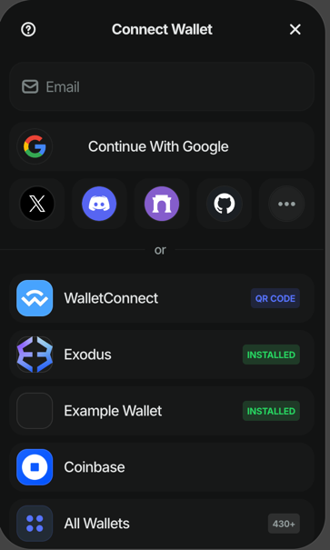

This repository is a minimal reproducible example to demo that `web3modal`
does not properly display EIP6963-only (no `window.ethereum` injection) wallets 
in the Connection Modal.

## Steps to reproduce

1. Install the dependencies:
```bash
npm i
```

2. Start the project
```bash
npm run dev
```

3. Disable all Browser Extensions, observe that `web3modal` does not display the 
[Example Wallet](https://github.com/ExodusMovement/web3modal-eip6963-bug/blob/d377964d86c87c59fd2fd5d9846bb2a5d06b8add/src/context/injectEIP6963.ts#L1-L30), which is an EIP6963-only wallet:


4. Turn on any Ethereum wallet that injects its provider to window.ethereum, observe that `web3modal`
starts displaying the Example Wallet as well:

